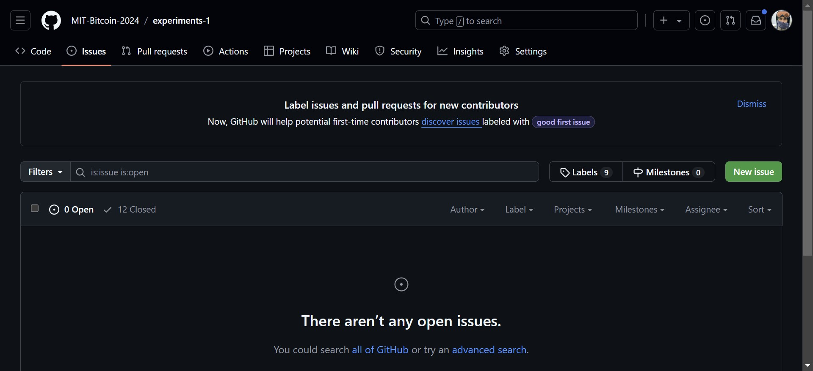

# The Power of Bounties in Innovation: A Historical and Modern Perspective

<figure><figcaption></figcaption></figure>

_August 10, 2024_

In the early 18th century, the British government faced a formidable challenge: how to accurately determine a ship's longitude at sea. The inability to do so led to numerous shipwrecks and lost lives, posing a significant threat to the empire's naval dominance and maritime trade. To solve this critical problem, the British Parliament, in 1714, offered a substantial reward known as the "Longitude Prize." This bounty was open to anyone who could devise a reliable method for calculating longitude at sea. While many prominent scientists and astronomers attempted to solve the problem, it was a relatively unknown clockmaker, John Harrison, who ultimately succeeded. Harrison's marine chronometer revolutionized navigation and underscored the potential of using innovation prizes, or bounties, to solve complex challenges.

The concept of bounties as a catalyst for innovation has a long and storied history. These prizes have been used by governments, organizations, and private entities to encourage individuals and small teams to tackle specific problems. Unlike large-scale efforts such as the X-Prize, which often require significant resources and are typically pursued by well-funded organizations, bounties are accessible to a broader audience. They offer a unique opportunity for independent inventors, small teams, and even hobbyists to compete on a level playing field, where creativity and ingenuity are the primary currencies.

One of the most compelling aspects of bounties is that they democratize innovation. By opening competitions to anyone with the skills and determination to solve a problem, bounties tap into a diverse pool of talent that might otherwise go unnoticed. This inclusivity fosters a wide range of solutions, often leading to breakthroughs that traditional research and development methods might not achieve. Furthermore, because bounties typically focus on specific, well-defined problems, they encourage participants to think creatively and pragmatically, leading to solutions that are both innovative and practical.

#### Modern Day Bounties

In the modern era, the concept of bounties has been revitalized and expanded through platforms like Kaggle. Kaggle is a popular online community that hosts machine learning competitions, where individuals and small teams can compete to develop the best models for various data science challenges. These competitions offer cash prizes, but more importantly, they provide participants with the opportunity to demonstrate their skills, gain recognition, and contribute to solving real-world problems. Kaggle competitions have led to significant advancements in fields such as healthcare, finance, and environmental science, illustrating the power of bounties to drive innovation in diverse areas.

The success of platforms like Kaggle highlights another key advantage of bounties: they encourage collaboration and knowledge sharing. While participants compete against each other, many also share their approaches and insights with the community. This open exchange of ideas accelerates the pace of innovation, as participants build on each other's work and refine their solutions. Moreover, the competitive nature of bounties incentivizes participants to push the boundaries of what is possible, often leading to breakthroughs that extend beyond the scope of the original challenge.

#### Bounties: Powering Innovation Ecosystems

Bounties also serve as a powerful motivator by offering a clear and tangible reward for innovation. Unlike traditional research grants or funding, which may require extensive applications and approval processes, bounties are straightforward: solve the problem, and you win the prize. This simplicity appeals to many innovators who prefer to focus on the challenge itself rather than navigating bureaucratic hurdles. Additionally, the competitive aspect of bounties adds an element of excitement and urgency, driving participants to work harder and faster to achieve their goals.

The impact of bounties extends beyond the immediate winners. Often, the solutions developed in response to a bounty have broader applications, leading to new products, services, or technologies that benefit society as a whole. For example, John Harrison's marine chronometer not only solved the problem of determining longitude at sea but also laid the groundwork for the development of precise timekeeping, which is crucial for various fields, including telecommunications and GPS technology.

Furthermore, bounties can stimulate entire industries by drawing attention to specific challenges and encouraging a focus on innovation. For instance, in the field of machine learning, Kaggle competitions have inspired thousands of data scientists to hone their skills, leading to a surge in expertise and interest in this critical area. As a result, bounties can play a crucial role in shaping the direction of technological progress and ensuring that key challenges receive the attention they deserve.

Another important aspect of bounties is their ability to uncover hidden talent. By opening competitions to a wide audience, bounties often attract participants who may not have traditional credentials or experience but possess the creativity and problem-solving skills needed to succeed. This inclusivity allows for a more diverse range of perspectives and approaches, which can lead to more innovative and effective solutions. It also provides an entry point for individuals who may not have had the opportunity to contribute to a particular field, fostering a more inclusive and dynamic innovation ecosystem.

#### Lightning Bounties: The Next Step in Micro Bounties

As discussed, most innovation bounty prizes took months or years to complete in the past. While some of these bounties are still remembered today due to their difficult and impactful nature, the problem bounty solvers is the significant risk of spending so much time.

This is why Lightning Bounties is a significant advance in bounties. We break them down into very small pieces and reward the prize immediately. It's not unheard of to earn multiple bounties in a single day. With this rate of feedback, bounty hunters can focus their efforts on the languages, projects that are best suited to their skills and earning goals.

#### Earn Your First Bounty Now - By adding to this article

So much for theory, time to take action...and get paid!

Respond to this article by adding an example of a historical or modern day bounty system and add to the article. To do this simply

* Sign up by "Log In with GitHub" at [beta.lightningbounties.com](https://beta.lightningbounties.com)
* Review the metrics for evaluating submissions [here](https://github.com/MIT-Bitcoin-2024/demo-gitbook/issues/27)
* Fork the repo, make a commit and submit a PR as described [here](https://docs.lightningbounties.com/docs/solve-a-bounty/working-on-the-bounty). _Notice this works because this website (powered by_ [_Gitbook_](https://www.gitbook.com/)_) is sync'd with an underlying git repository._&#x20;
* Wait for a team member to review your changes and merge them into the git repo

After these steps are complete: you should now have sats deposited into your profile. Now you can use those sats to withdraw them into your wallet or to post a bounty of your own.

