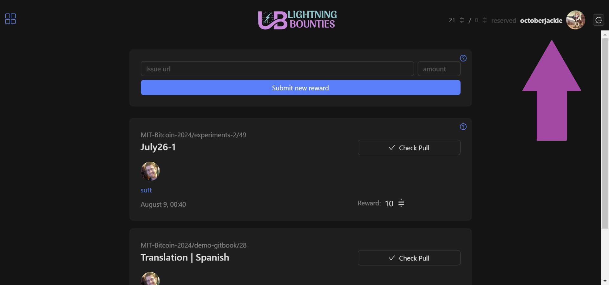
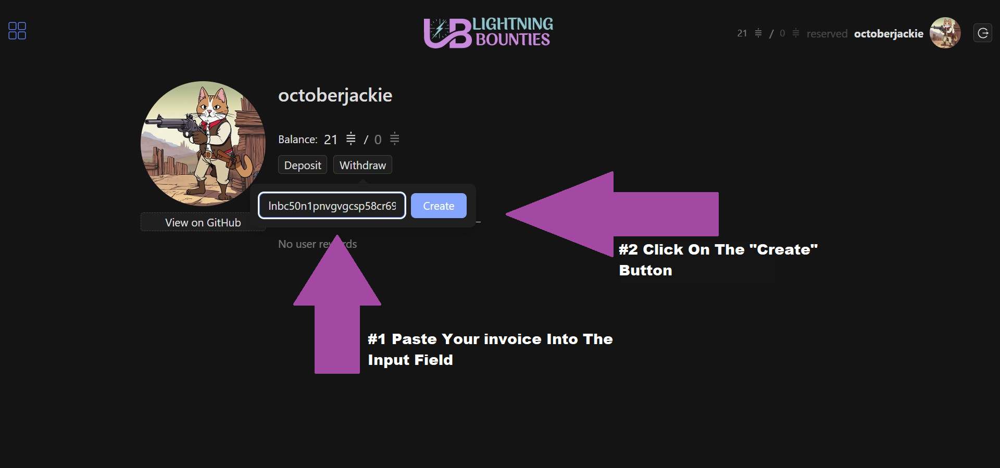

# How to Convert Sats into Local Currencies

## Getting Started

To withdraw Sats from the Lightning Network to Coinbase (or any other wallet/exchange), follow these steps. The process remains similar no matter where you're transferring your funds.

## <mark style="background-color:green;">**Part (1):**</mark>**&#x20;Receiving Bitcoin via Lightning**

***

1. Sign in to your Coinbase account.
2. Select **Bitcoin** as the asset you wish to receive.
3. Select the Lightning network.
4. Follow the prompts to create your invoice
   * Invoices are valid for 72 hours.
5. Copy the invoice. You will need this in the next section.



***

## <mark style="background-color:green;">**Part (2):**</mark>**&#x20;How to withdraw sats from Lightning Bounties to Coinbase?**

***

1. **Login to Lightning Bounties:**  then click on your account.

2. **Initiate Withdrawal:** Select the option to withdraw your sats.

3a. First, paste your invoice string into the input field&#x20;

&#x20;    [  _(the same one you copied on your Coinbase account in the previous step)._  ](how-to-convert-sats-into-local-currencies.md#getting-started)

3b. Click the “Create”

4. Your sats should now be reflected in your Coinbase account after the transaction is confirmed.

***

## <mark style="background-color:green;">**Part (3):**</mark>**&#x20;Converting Your Crypto Into Fiat Using Coinbase.**&#x20;


Before you can cash out your crypto, you may need to sell it to your Coinbase cash balance before transferring the cash to your bank. You can then either transfer ("cash out") the funds to your bank or leave them in your cash balance for future crypto purchases. There's no limit on the amount of crypto you can sell for cash.




### **3a. Sell crypto to your Coinbase cash balance**

#### **To sell your crypto:**

1. Sign in to your Coinbase account, on the web or mobile app
2. Select **Buy & Sell**
3. Select **Sell**
4.  Select the crypto you want to sell and the amount.

    _<mark style="color:yellow;">If on mobile, you'll be required to crypto the asset you want to sell before entering an amount</mark>_
5. Change the **To** destination, if applicable.
   * This will likely default to your local currency balance (USD) but you may have the option of adding to another balance (e.g., USDC).
6. Select **Review order.**
7. Select **Sell now** to complete the sale.

Once the crypto sell order is complete, the funds will be available in your cash balance to buy other assets or cash out to your bank.

### **3b. Cash out your funds**

| Browser                                                                                                        | Mobile app                                                                                                                             |
| -------------------------------------------------------------------------------------------------------------- | -------------------------------------------------------------------------------------------------------------------------------------- |
| 

<ol><li>Sign in to your <a href="http://coinbase.com">Coinbase.com</a> account.</li></ol>               | <ol><li>Access the Coinbase mobile app.</li></ol>                                                                                      |
| <ol start="2"><li>Select <strong>My</strong> <strong>Assets.</strong></li></ol>                                | <ol start="2"><li>Select <strong>My assets</strong>, then <strong>Cash out</strong>.</li></ol>                                         |
| <ol start="3"><li>Select your local currency balance.</li></ol>                                                | <ol start="3"><li>Enter the amount you want to cash out.</li></ol>                                                                     |
| <ol start="4"><li>Select the <strong>Cashout</strong> tab and enter the amount you want to cash out.</li></ol> | <ol start="4"><li>Select your <strong>Cash out from</strong> balance and choose your <strong>Deposit to</strong> destination</li></ol> |
| <ol start="5"><li>Select <strong>Transfer to</strong> and choose your cash-out destination.</li></ol>          | <ol start="5"><li>Select <strong>Preview cash out</strong> and confirm your selections.</li></ol>                                      |
| <ol start="6"><li>Select <strong>Review.</strong></li></ol>                                                    | <ol start="6"><li>Select <strong>Cash out now</strong> to complete your transfer.</li></ol>                                            |
| <ol start="7"><li>Select <strong>Withdraw cash</strong> to complete your transfer.</li></ol>                   |                                                                                                                                        |

