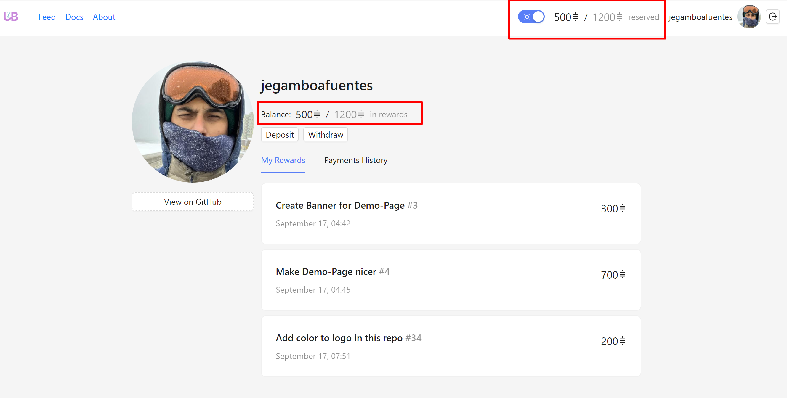

# User Balances Overview

<figure><figcaption></figcaption></figure>

## Available Balance

The **available balance** represents the amount of satoshis (sats) a user currently holds and can use to post new rewards on GitHub issues. This balance is also withdrawable, allowing the user to transfer their available sats to a personal Lightning Network wallet at any time.

## Reserved Balance

The **reserved balance** consists of the sats that are allocated to already posted rewards on GitHub issues. When a user posts a reward, the corresponding amount of sats is locked in this balance, ensuring that the reward is paid out once the issue is resolved.

By tracking these balances, users can easily manage their available funds and reserved rewards while contributing to the open-source community.
